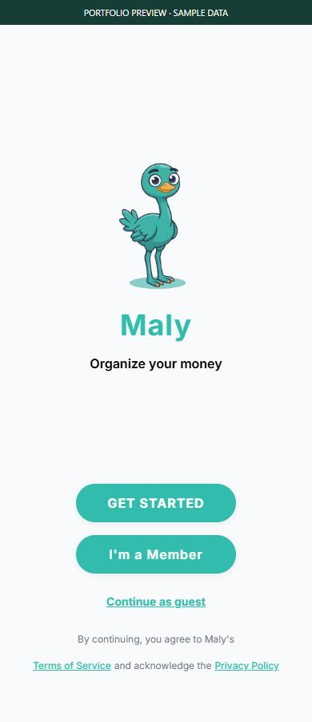
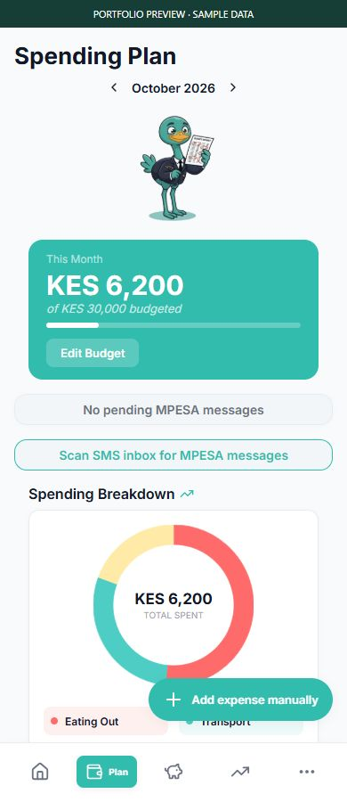
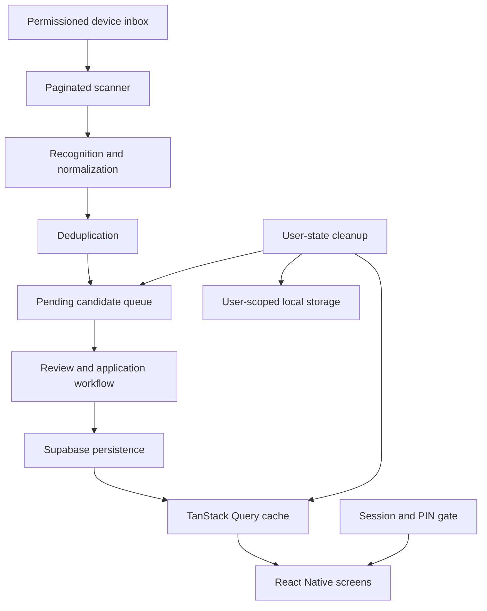

# Maly

### Mobile engineering: reliable ingestion and deliberate state boundaries

[Profile](https://github.com/Lawi-Mwaura) · [Documentation index](https://github.com/Lawi-Mwaura/Lawi-Mwaura/blob/main/case-studies/README.md) · [I-soco](https://github.com/Lawi-Mwaura/I-soco-showcase)

  
  &nbsp;&nbsp;
  

*Actual application components rendered in an isolated web preview. Backend calls are replaced with local fixtures. Financial values are sample data; native-device behavior is not demonstrated by these images.*

## Engineering scope

Maly is a React Native and Expo personal finance application backed by Supabase. Its engineering work includes device-message parsing, inbox recovery, local queues, authenticated navigation, and user-state cleanup. This overview focuses on those boundaries; source code and commercial plans remain private.

| Layer | Responsibility |
| :--- | :--- |
| React Native / Expo Router | Mobile screens, navigation, and authentication entry points. |
| Native inbox integration | Read permitted device messages and expose them to the ingestion pipeline. |
| Parser and inbox scanner | Recognize supported message formats, normalize fields, paginate reads, and queue candidates. |
| Zustand | Manage client state and pending transaction candidates. |
| TanStack Query | Fetch, cache, refresh, and clear server-derived data. |
| Supabase | Authentication and persisted application records. |
| Local / secure storage | Persist selected device state and separate security state from general caches. |

## System design

*Simplified component map. Device permissions and secure-storage behavior need native-device validation; a web preview cannot establish them.*

The ingestion pipeline separates reading, recognition, parsing, deduplication, and application state. That separation makes a malformed message testable without starting the entire app or reading a real inbox.

### 1. Message parsing is a data-quality boundary

**Failure:** transaction messages differ in punctuation, amount formatting, merchant wording, date patterns, and transaction type. Promotional messages and authentication messages must not become financial records.

**Design:** recognize supported transaction messages first, then normalize structured fields through a dedicated parser. Fixtures exercise multiple message forms, amounts, merchant extraction, dates, transaction identifiers, and category suggestions. Unrecognized transaction types can enter a review path rather than being treated as known automatically.

**Invariant:** an unrelated message must not be accepted as a transaction; uncertain fields must remain distinguishable from known values.

**Tradeoff:** explicit parsing rules are easy to inspect and test, but formats can evolve. Adding new fixtures before extending a parser keeps that maintenance visible. Category suggestions should remain suggestions.

### 2. Inbox recovery must survive interrupted reads

**Failure:** after time away from the app, a single inbox page misses older messages. Advancing the scan cursor after a failed read can skip unprocessed data.

**Design:** read inbox pages within a bounded scan, retain an overlap between scans, deduplicate message identities and parsed transaction keys, and advance the cursor only when the scan is considered completed. Existing tests verify multi-page cold-start scanning and cursor preservation on read failure.

**Invariant:** a failed inbox read must not advance the stored scan cursor.

**Tradeoff:** overlap intentionally reads some messages more than once, so deduplication is essential. A bounded scan limits device work but introduces an important edge case: reaching the page cap must be examined before claiming complete ingestion of an arbitrarily large inbox.

### 3. Session changes involve more than a token

**Failure:** the account changes but local categories, pending items, or cached server data survive. The next session can inherit stale state.

**Design:** explicit cleanup removes selected user-scoped local data, clears the native queue and pending client state, and clears the query cache through the reset path. Cleanup treats general caches and authentication/PIN persistence separately. Preserving a member’s PIN setup is an intentional lifecycle decision, not a reason to retain their financial cache.

**Invariant:** user data cleanup and authentication decisions must have separate, testable responsibilities.

**Tradeoff:** separate lifecycles reduce unnecessary setup for returning members, but require tests for logout, guest, returning-member, and PIN states. Cleanup tests mock storage and native boundaries; they do not prove behavior on every device.

### 4. Authentication routing should be explicit

The authentication gate evaluates new-user, logged-out member, guest, PIN setup, PIN entry, and remembered-session cases. Secure-storage tests also cover migration of legacy PIN state and repair of incomplete setup flags.

This makes routing policy inspectable as a decision function. Device-specific storage and permission behavior still need testing on supported native platforms.

## Validation

On **1 October 2026**, **55 tests across five selected suites passed**: parser, inbox scanner, user-state cleanup, authentication gate, and PIN storage.

These checks exercise fixtures and mocked device/storage boundaries. They do not establish an end-to-end native-device pass, a security audit, live backend isolation, or measured performance. The screenshots demonstrate the real interface components with local sample data.

## Operational and growth questions

The following are evaluation priorities, not claimed performance results:

- **Large inboxes:** test page-cap exhaustion and recovery before asserting that every message is imported.
- **Queue persistence:** verify behavior when the app terminates between reading, review, and persistence.
- **Account transitions:** test cleanup with real storage, queued native events, and a restored session.
- **Format drift:** add anonymized fixtures for previously unseen patterns and track parse failures without retaining raw financial messages in telemetry.
- **Device behavior:** validate permissions, background execution, secure storage, and offline recovery on supported devices.

## Technical discussion

I can walk through parser boundaries, cursor correctness, deduplication versus successful persistence, query-cache lifecycle, and the tradeoffs between mobile convenience and explicit security state.

**Stack:** TypeScript · React Native · Expo · Supabase · TanStack Query · Zustand

[Contact Lawi](mailto:lawimwaura@gmail.com) · [Back to profile](https://github.com/Lawi-Mwaura)
