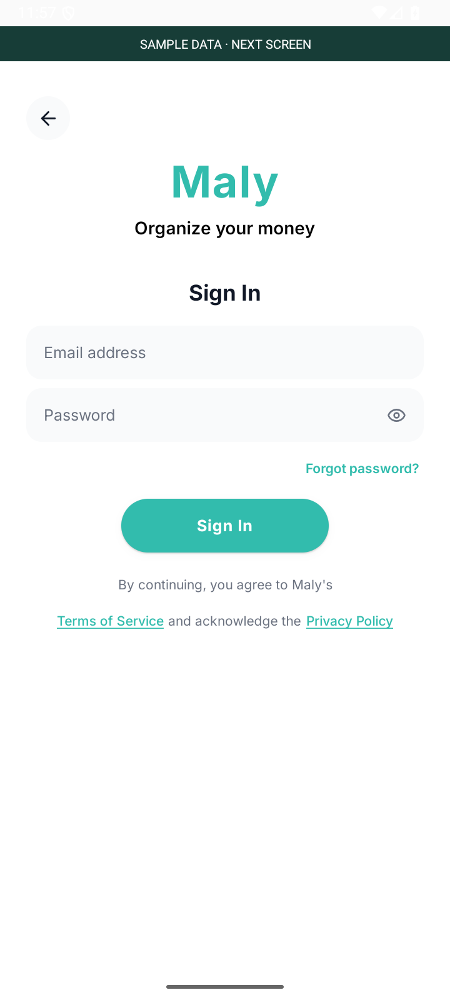
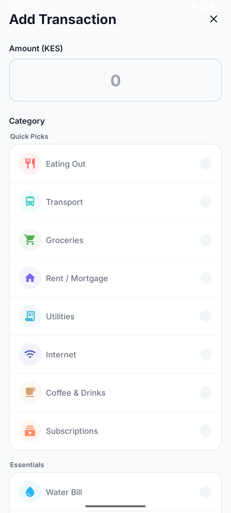

# Maly

### Mobile engineering: reliable ingestion and deliberate state boundaries

[Profile](https://github.com/Lawi-Mwaura) · [Documentation index](https://github.com/Lawi-Mwaura/Lawi-Mwaura/blob/main/case-studies/README.md) · [I-soco](https://github.com/Lawi-Mwaura/I-soco-showcase)

**Private source repository:** [Lawi-Mwaura/maly](https://github.com/Lawi-Mwaura/maly). Access is limited to authorized collaborators; GitHub may show a 404 to public visitors.

[Problem](#problem-statement) · [Architecture](#system-design) · [Native gallery](#native-interface-gallery) · [Evidence](#metrics-and-evidence)

## Problem statement

Managing everyday finances is difficult when spending records are scattered across messages and a budget has to be reconstructed manually. People need a usable view of transactions, spending plans and savings goals. Maly brings those records and planning tools into a mobile interface.

**Engineering challenge.** A mobile finance interface needs useful records from inconsistent device messages. Interrupted reads, duplicate inputs, and account transitions must not silently lose data or retain stale user state.

  
  &nbsp;&nbsp;
  

*Actual application components running in an isolated Android phone emulator. Backend calls are replaced with local fixtures and financial values are labeled as sample data. These captures demonstrate native rendering; they do not establish end-to-end inbox, permission, or storage behavior.*

## Technologies used

TypeScript · JavaScript · React Native · Expo · Expo Router · Kotlin · Android SDK / BroadcastReceiver · React Native bridge · Supabase Auth / PostgreSQL · REST APIs / Node.js · TanStack Query · Zustand · AsyncStorage · Expo SecureStore · NativeWind / Tailwind CSS · React Hook Form · Zod · React Native Skia · Reanimated · Victory Native · GitHub Actions · Expo/EAS · Grafana Faro · Sentry · Jest · Testing Library

## Engineering scope

Maly is a React Native and Expo personal finance application backed by Supabase. Its engineering work includes device-message parsing, inbox recovery, local queues, authenticated navigation, and user-state cleanup. This overview focuses on those boundaries; source code and commercial plans remain private.

| Layer | Responsibility |
| :--- | :--- |
| React Native / Expo Router | Mobile screens, navigation, and authentication entry points. |
| Native inbox integration | Read permitted device messages and expose them to the ingestion pipeline. |
| Parser and inbox scanner | Recognize supported message formats, normalize fields, paginate reads, and queue candidates. |
| Zustand | Manage client state and pending transaction candidates. |
| TanStack Query | Fetch, cache, refresh, and clear server-derived data. |
| Supabase | Authentication and persisted application records. |
| Local / secure storage | Persist selected device state and separate security state from general caches. |

## System design

**Component architecture.** The boxes identify technologies and responsibilities; boundaries group the application runtime and managed backend. Relationships show dependencies and integration protocols, rather than a step-by-step processing flow.

*Logical component architecture. Device permissions, secure storage, and backend policy enforcement require separate native and live-backend verification.*

The ingestion pipeline separates reading, recognition, parsing, deduplication, and application state. That separation makes a malformed message testable without starting the entire app or reading a real inbox.

## Challenges and engineering decisions

### 1. Message parsing is a data-quality boundary

**Failure:** transaction messages differ in punctuation, amount formatting, merchant wording, date patterns, and transaction type. Promotional messages and authentication messages must not become financial records.

**Design:** recognize supported transaction messages first, then normalize structured fields through a dedicated parser. Fixtures exercise multiple message forms, amounts, merchant extraction, dates, transaction identifiers, and category suggestions. Unrecognized transaction types can enter a review path rather than being treated as known automatically.

**Invariant:** an unrelated message must not be accepted as a transaction; uncertain fields must remain distinguishable from known values.

**Tradeoff:** explicit parsing rules are easy to inspect and test, but formats can evolve. Adding new fixtures before extending a parser keeps that maintenance visible. Category suggestions should remain suggestions.

### 2. Inbox recovery must survive interrupted reads

**Failure:** after time away from the app, a single inbox page misses older messages. Advancing the scan cursor after a failed read can skip unprocessed data.

**Design:** read inbox pages within a bounded scan, retain an overlap between scans, deduplicate message identities and parsed transaction keys, and advance the cursor only when the scan is considered completed. Existing tests verify multi-page cold-start scanning and cursor preservation on read failure.

**Invariant:** a failed inbox read must not advance the stored scan cursor.

**Tradeoff:** overlap intentionally reads some messages more than once, so deduplication is essential. A bounded scan limits device work but introduces an important edge case: reaching the page cap must be examined before claiming complete ingestion of an arbitrarily large inbox.

### 3. Session changes involve more than a token

**Failure:** the account changes but local categories, pending items, or cached server data survive. The next session can inherit stale state.

**Design:** explicit cleanup removes selected user-scoped local data, clears the native queue and pending client state, and clears the query cache through the reset path. Cleanup treats general caches and authentication/PIN persistence separately. Preserving a member’s PIN setup is an intentional lifecycle decision, not a reason to retain their financial cache.

**Invariant:** user data cleanup and authentication decisions must have separate, testable responsibilities.

**Tradeoff:** separate lifecycles reduce unnecessary setup for returning members, but require tests for logout, guest, returning-member, and PIN states. Cleanup tests mock storage and native boundaries; they do not prove behavior on every device.

### 4. Authentication routing should be explicit

The authentication gate evaluates new-user, logged-out member, guest, PIN setup, PIN entry, and remembered-session cases. Secure-storage tests also cover migration of legacy PIN state and repair of incomplete setup flags.

This makes routing policy inspectable as a decision function. Device-specific storage and permission behavior still need testing on supported native platforms.

## Outcomes

- Recognition and normalization separate supported transaction messages from unrelated inputs.
- Failed inbox reads preserve the scan cursor; overlap and deduplication support recovery.
- Explicit reset paths clear selected user data, pending queues, and query caches.
- Authentication routing separates guest, returning-member, PIN setup, and PIN entry states.

These are implementation outcomes supported by the reviewed source, not measured production improvements.

## Metrics and evidence

| Measure | Evidence |
| :--- | :--- |
| Selected tests | **55 passed across five suites** on 1 October 2026. |
| Test scope | Parser, inbox, cleanup, authentication gate, and PIN storage; device/storage boundaries are mocked. |
| Interface evidence | Actual native components captured in an isolated Android emulator with local fixtures. |
| Production metrics | No verified active-user, ingestion-throughput, retention, or latency figures supplied. |

## Validation

On **1 October 2026**, **55 tests across five selected suites passed**: parser, inbox scanner, user-state cleanup, authentication gate, and PIN storage.

These checks exercise fixtures and mocked device/storage boundaries. They do not establish an end-to-end native-device pass, a security audit, live backend isolation, or measured performance. The screenshots demonstrate the real interface components with local sample data.

## Operational and growth questions

The following are evaluation priorities, not claimed performance results:

- **Large inboxes:** test page-cap exhaustion and recovery before asserting that every message is imported.
- **Queue persistence:** verify behavior when the app terminates between reading, review, and persistence.
- **Account transitions:** test cleanup with real storage, queued native events, and a restored session.
- **Format drift:** add anonymized fixtures for previously unseen patterns and track parse failures without retaining raw financial messages in telemetry.
- **Device behavior:** validate permissions, background execution, secure storage, and offline recovery on supported devices.

## Native interface gallery

Five Android emulator captures of the actual React Native components, taken on **2 October 2026**. Screens are isolated from the live backend and inbox. All financial values come from synthetic fixtures. Device-message permissions are intentionally disabled; the permission warning is shown honestly.

| 01 · Welcome | 02 · Goal selection |
| :---: | :---: |
|  |  |

Entry choices and onboarding hierarchy from the actual application screens. Fixture navigation appears above the screen; it is a preview control.

| 03 · Member sign-in | 04 · Spending plan |
| :---: | :---: |
|  |  |

Empty authentication fields expose no credentials. The spending plan combines summary, breakdown, navigation, and a manual-entry fallback. The capture does not establish live authentication or inbox ingestion.

### 05 · Manual transaction entry

Actual category-selection controls with no transaction submitted. This modal covers the fixture banner; it still uses the same isolated preview and contains no real financial records.

## Technical discussion

I can walk through parser boundaries, cursor correctness, deduplication versus successful persistence, query-cache lifecycle, and the tradeoffs between mobile convenience and explicit security state.

**Stack:** TypeScript · JavaScript · React Native · Expo · Expo Router · Kotlin · Android SDK / BroadcastReceiver · React Native bridge · Supabase Auth / PostgreSQL · REST APIs / Node.js · TanStack Query · Zustand · AsyncStorage · Expo SecureStore · NativeWind / Tailwind CSS · React Hook Form · Zod · React Native Skia · Reanimated · Victory Native · GitHub Actions · Expo/EAS · Grafana Faro · Sentry · Jest · Testing Library

[Contact Lawi](mailto:lawimwaura@gmail.com) · [Back to profile](https://github.com/Lawi-Mwaura)
